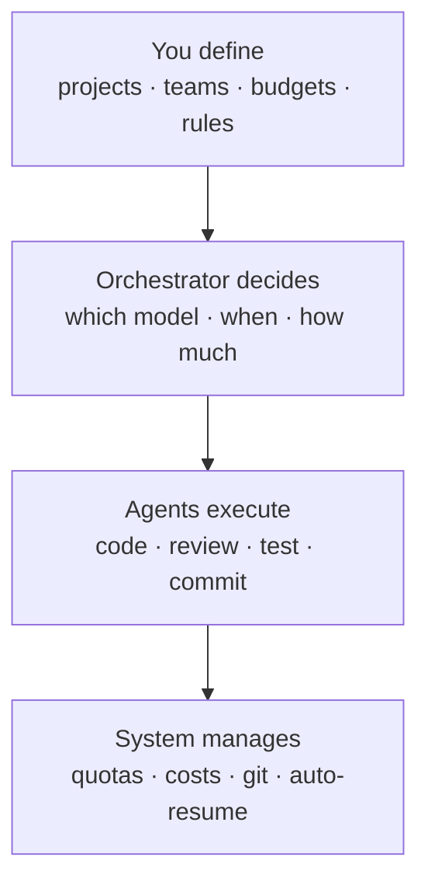
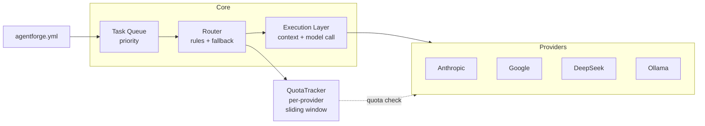

# AgentForge

**Multi-agent orchestration platform with cost control, quota management, and intelligent model routing.**

AgentForge lets you run multiple AI agents across different projects, automatically routing tasks to the right model (Opus for architecture, Sonnet for coding, DeepSeek/local for bulk work) while keeping costs under control and respecting API rate limits.



## Why AgentForge?

- **Cost control** — Set budgets per project. Auto-pause when budget runs out. Route to cheaper models when budget is low.
- **Quota management** — Sliding window tracking per provider. Auto-pause agents when quota hits. Auto-resume when window resets. No wasted time.
- **Model routing** — Tier system: T1 (strategy) → T2 (development) → T3 (execution). Automatic fallback chains. Local models via Ollama for $0.
- **GitHub integration** — Agents commit to branches, auto-create PRs, require review before merge.
- **OSS & self-hosted** — Your keys, your data, your rules. No SaaS dependency.

## Quick Start

```bash
# Install
npm install -g agentforge
# or clone and run locally
git clone https://github.com/your-user/agentforge.git
cd agentforge && npm install

# Configure
cp agentforge.example.yml agentforge.yml
# Edit with your API keys and project config

# Run
agentforge start
# Opens dashboard at http://localhost:4242
```

## Architecture



See [docs/architecture.md](docs/architecture.md) for the full design.

## Configuration

Everything is configured in `agentforge.yml`:

```yaml
project:
  name: "My Project"
  budget: 50.00

providers:
  anthropic:
    api_key: ${ANTHROPIC_API_KEY}
    quota:
      max_requests_per_minute: 100
      auto_pause: true
      auto_resume: true
  ollama:
    endpoint: http://localhost:11434

routing:
  rules:
    - match: { type: [architecture, planning] }
      tier: 1
      prefer: claude-opus-4
    - match: { type: [implement, refactor] }
      tier: 2
      prefer: claude-sonnet-4
    - match: { type: [test, script, bulk] }
      tier: 3
      prefer: ollama/codestral:22b

team:
  - name: Architect
    model: claude-opus-4
    system_prompt_file: prompts/architect.md
    tools: [file_read, ask_agent]
  - name: Developer
    model: claude-sonnet-4
    tools: [file_read, file_write, git_commit, run_tests]
    reviewer: Architect
```

See [agentforge.example.yml](agentforge.example.yml) for the full reference.

## Roadmap

See [ROADMAP.md](ROADMAP.md) for detailed milestones.

| Phase | What | Status |
|-------|------|--------|
| **v0.1** | Core engine: router + quota + single agent execution | ✅ Done |
| **v0.2** | Multi-agent: lifecycle, dependencies, inter-agent comms | ✅ Done |
| **v0.3** | GitHub integration: branches, PRs, auto-review | ✅ Done |
| **v0.4** | Web dashboard API: REST + WebSocket + parallel execution | ✅ Done |
| **v0.5** | CLI + plugin system + Docker + tests (257 passing) | ✅ Done |
| **v0.6** | Web UI: dashboard, kanban, agent/provider config | 🔨 Next |

## Contributing

See [CONTRIBUTING.md](CONTRIBUTING.md). Issues and PRs welcome.

## License

MIT
