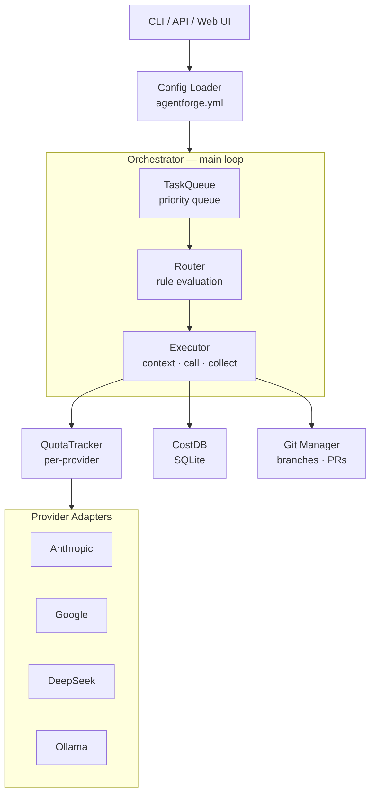
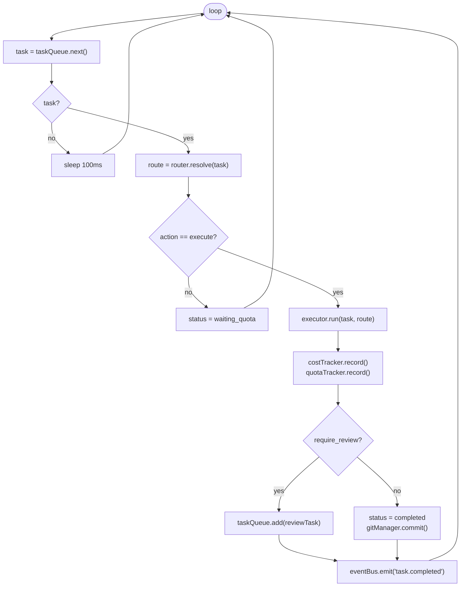
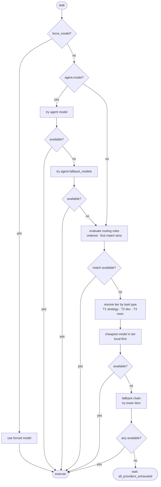
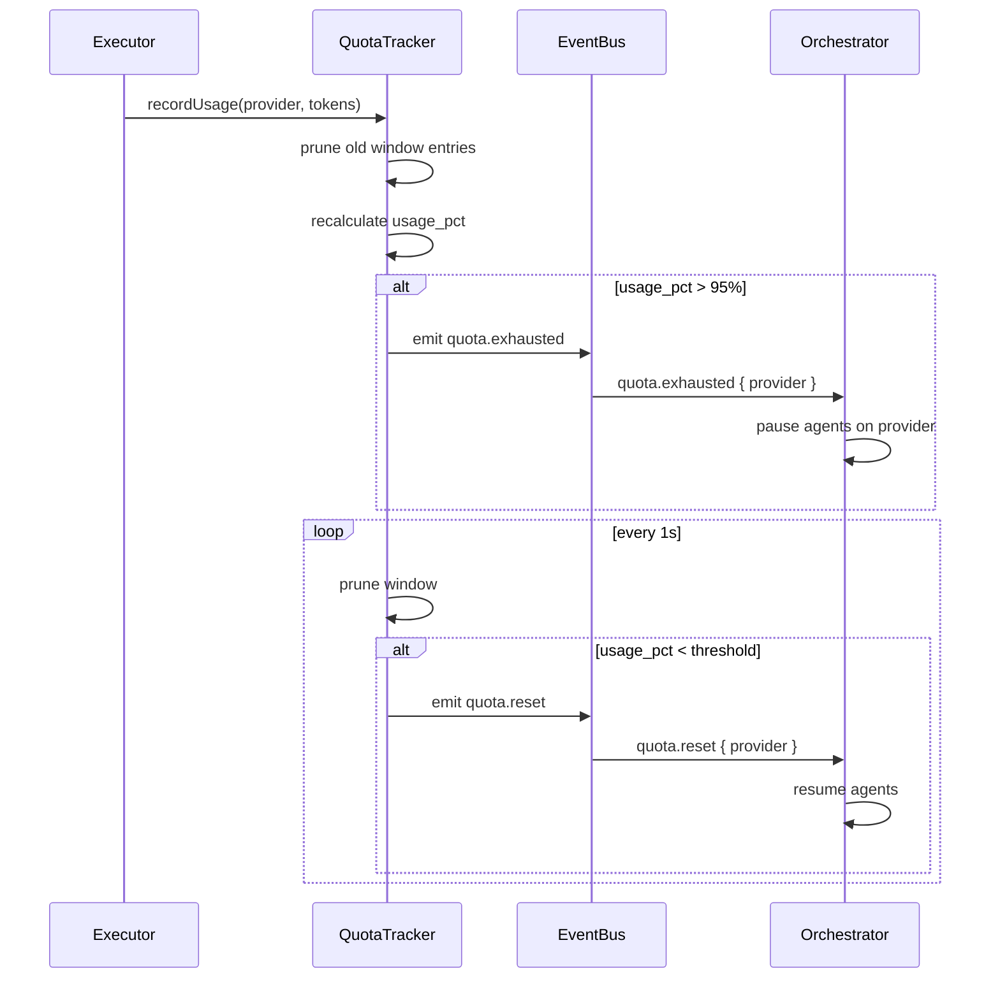
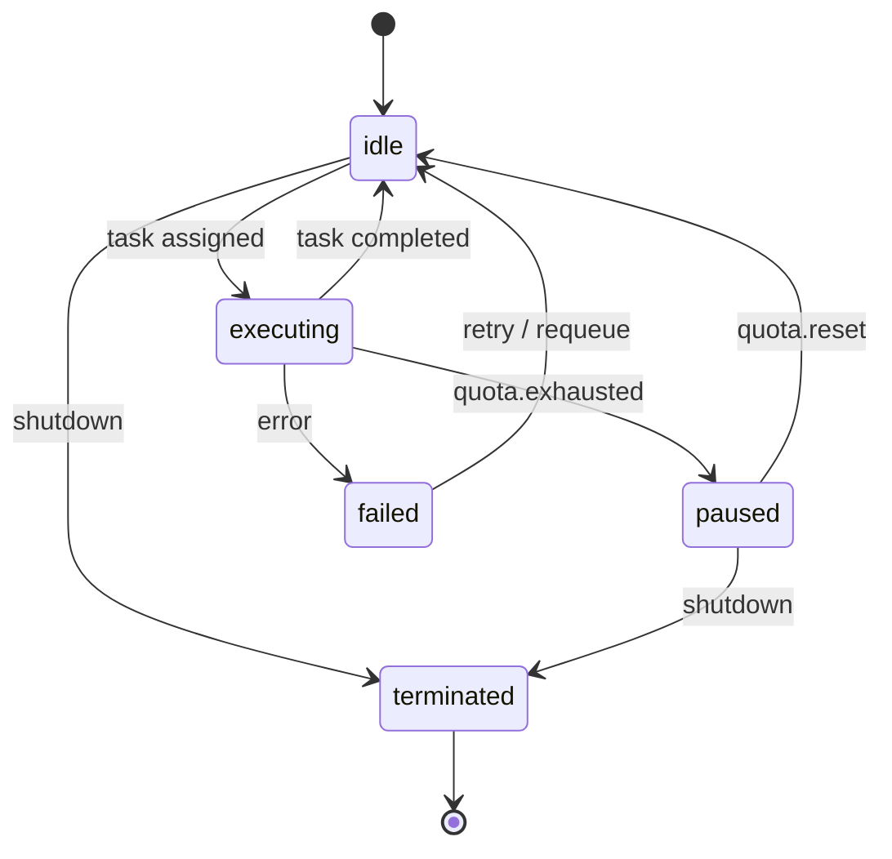
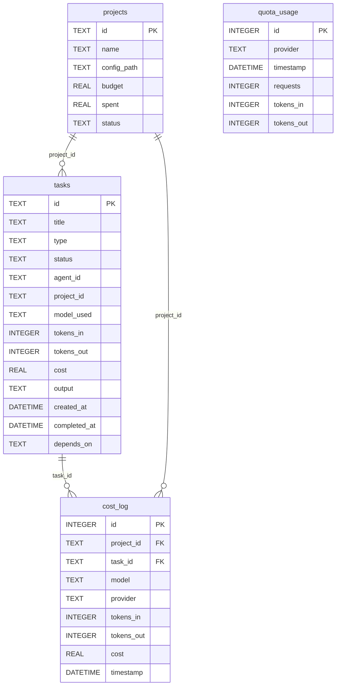

# Architecture

## Design Principles

1. **Deterministic routing** — No AI decides which AI to use. Rules are explicit, auditable, configurable.
2. **Fail gracefully** — Quota exhausted? Fallback. Budget exceeded? Pause. Provider down? Next in chain.
3. **Config as code** — `agentforge.yml` is the source of truth. The UI reads/writes it. The repo travels with the config.
4. **Agents are stateless** — An agent is a configuration, not a process. No persistent memory between tasks.
5. **Everything is an event** — Components communicate via EventBus. Easy to log, debug, extend.

## System Overview



## Component Details

### Orchestrator (`src/core/orchestrator.js`)

The main loop. Runs continuously, pulling tasks and dispatching them.



### Router (`src/routing/router.js`)

Deterministic decision engine. No randomness, no AI.

**Input:** Task metadata (type, priority, context_tokens, agent, project)
**Output:** { model, provider, tier, fallback_chain }

**Evaluation order:**



### QuotaTracker (`src/core/quota-tracker.js`)

Per-provider sliding window rate limiter.

```
QuotaTracker {
  windows: Map<provider_id, SlidingWindow>

  canExecute(provider, estimated_tokens): boolean
  recordUsage(provider, tokens_in, tokens_out): void
  getState(provider): "available" | "throttled" | "exhausted"
  getResetEstimate(provider): seconds
}

SlidingWindow {
  entries: Array<{ timestamp, value }>
  window_size: Duration
  max_value: number

  add(value): void
  prune(): void        // Remove entries older than window
  sum(): number
  count(): number
  usage_pct(): number  // sum / max_value
}
```

**Auto-pause flow:**



### Provider Adapters (`src/providers/`)

Unified interface, provider-specific implementation.

```typescript
interface Provider {
  id: string
  name: string

  execute(params: {
    model: string
    messages: Message[]
    tools?: Tool[]
    max_tokens?: number
    temperature?: number
    stream?: boolean
  }): Promise<{
    content: string
    tokens_in: number
    tokens_out: number
    tool_calls?: ToolCall[]
    raw_response?: any
  }>

  listModels(): Promise<string[]>
  healthCheck(): Promise<boolean>
}
```

### Agent Definition

Agents are pure configuration, not runtime objects.

```typescript
interface AgentConfig {
  id: string
  name: string
  role: string
  model: string                    // Default model
  fallback_models?: string[]       // If default unavailable
  allow_tier_downgrade?: boolean

  system_prompt: string
  system_prompt_file?: string      // Loaded from file
  knowledge?: string[]             // Files injected into context

  tools: string[]                  // Available tools
  max_tokens_per_task?: number
  max_cost_per_task?: number

  require_review?: boolean
  reviewer?: string                // Agent ID
}
```

**Agent lifecycle:**



### Tools (`src/tools/`)

Actions agents can perform. Each tool follows a standard interface.

```typescript
interface Tool {
  name: string
  description: string
  parameters: JSONSchema

  execute(params: any, context: TaskContext): Promise<ToolResult>
}
```

Built-in tools:
- `file_read` — Read files from the project repo
- `file_write` — Write/modify files
- `git_commit` — Stage and commit changes
- `run_tests` — Execute test suite
- `shell_exec` — Run shell commands (sandboxed)
- `ask_agent` — Query another agent (via orchestrator)

### Event Bus (`src/core/event-bus.js`)

Simple pub/sub for decoupled communication.

```
Events:
  task.queued        { task }
  task.assigned      { task, agent, model }
  task.executing     { task, agent }
  task.completed     { task, result, cost }
  task.failed        { task, error }
  quota.throttled    { provider, usage_pct }
  quota.exhausted    { provider }
  quota.reset        { provider }
  agent.paused       { agent, reason }
  agent.resumed      { agent }
  budget.warning     { project, pct }
  budget.exceeded    { project }
  git.committed      { task, branch, sha }
  git.pr_created     { task, pr_url }
```

## Data Model



```sql
-- Core tables (SQLite)
CREATE TABLE projects (
  id TEXT PRIMARY KEY,
  name TEXT NOT NULL,
  config_path TEXT,
  budget REAL,
  spent REAL DEFAULT 0,
  status TEXT DEFAULT 'active'
);

CREATE TABLE tasks (
  id TEXT PRIMARY KEY,
  project_id TEXT REFERENCES projects(id),
  title TEXT NOT NULL,
  type TEXT,               -- architecture, implement, test, etc.
  priority TEXT DEFAULT 'medium',
  status TEXT DEFAULT 'queued',
  agent_id TEXT,
  model_used TEXT,
  tokens_in INTEGER DEFAULT 0,
  tokens_out INTEGER DEFAULT 0,
  cost REAL DEFAULT 0,
  output TEXT,
  created_at DATETIME DEFAULT CURRENT_TIMESTAMP,
  completed_at DATETIME,
  depends_on TEXT           -- JSON array of task IDs
);

CREATE TABLE quota_usage (
  id INTEGER PRIMARY KEY AUTOINCREMENT,
  provider TEXT NOT NULL,
  timestamp DATETIME DEFAULT CURRENT_TIMESTAMP,
  requests INTEGER DEFAULT 1,
  tokens_in INTEGER DEFAULT 0,
  tokens_out INTEGER DEFAULT 0
);

CREATE TABLE cost_log (
  id INTEGER PRIMARY KEY AUTOINCREMENT,
  project_id TEXT REFERENCES projects(id),
  task_id TEXT REFERENCES tasks(id),
  model TEXT,
  provider TEXT,
  tokens_in INTEGER,
  tokens_out INTEGER,
  cost REAL,
  timestamp DATETIME DEFAULT CURRENT_TIMESTAMP
);
```

## File Structure

```
agentforge/
├── agentforge.yml              # Project config (user creates this)
├── agentforge.example.yml      # Reference config
├── Dockerfile                  # Multi-stage build (node:20-alpine, non-root)
├── docker-compose.yml          # agentforge + ollama profile
├── docker/entrypoint.sh        # Container entrypoint
├── src/
│   ├── index.js                # createAgentForge() bootstrap
│   ├── cli.js                  # Commander.js CLI entry point
│   ├── config/
│   │   └── loader.js           # YAML parser + env var resolution
│   ├── core/
│   │   ├── orchestrator.js     # Main execution loop
│   │   ├── task-queue.js       # Priority queue with dependencies
│   │   ├── quota-tracker.js    # Sliding window per provider + QuotaManager
│   │   ├── cost-tracker.js     # Budget management per project/agent
│   │   ├── agent-lifecycle.js  # State machine (AgentLifecycle, AgentPool)
│   │   ├── dependency-graph.js # Task DAG with topological sort
│   │   └── event-bus.js        # EventEmitter singleton pub/sub
│   ├── routing/
│   │   └── router.js           # Full decision engine: rules, tiers, fallback
│   ├── providers/
│   │   ├── interface.js        # BaseProvider + OllamaProvider + ProviderRegistry
│   │   ├── anthropic.js        # @anthropic-ai/sdk adapter
│   │   ├── google.js           # @google/generative-ai adapter
│   │   ├── deepseek.js         # OpenAI-compatible (DeepSeek endpoint)
│   │   └── openrouter.js       # OpenAI-compatible + HTTP-Referer headers
│   ├── execution/
│   │   ├── context-builder.js  # Assembles prompts/messages for providers
│   │   ├── output-collector.js # Parses provider responses
│   │   ├── inter-agent-comm.js # ask_agent tool, subtask round-trips
│   │   ├── parallel-execution.js # Concurrency gate, Promise.allSettled
│   │   ├── review-workflow.js  # T1 approval gate via InterAgentComm
│   │   ├── task-decomposition.js # T1 breaks tasks into subtasks
│   │   └── index.js
│   ├── git/
│   │   ├── git-manager.js      # child_process git wrapper
│   │   ├── branch-strategy.js  # Branch naming per agent/task
│   │   ├── auto-commit.js      # Auto-commit on task completion
│   │   ├── auto-pr.js          # GitHub PR creation
│   │   ├── review-gate.js      # Approval gate (waitForApproval/approve/reject)
│   │   ├── github-integration.js # GitHub API via octokit
│   │   └── index.js            # Re-exports all git modules
│   ├── api/
│   │   ├── server.js           # Express REST API (15 routes)
│   │   ├── ws.js               # WebSocket server (18+ event types, replay)
│   │   └── index.js
│   ├── ui/
│   │   ├── index.html          # SPA shell + sidebar nav
│   │   ├── style.css           # Dark theme, Kanban, cards, toasts
│   │   └── app.js              # Router + all 5 views (pure ES modules)
│   ├── persistence/
│   │   └── db.js               # SQLite via better-sqlite3 (WAL mode)
│   └── plugins/
│       ├── plugin-manager.js   # Dynamic import, load/unload, BasePlugin
│       └── index.js
├── tests/
│   ├── api.test.js             # Integration tests for new REST endpoints
│   ├── core.test.js
│   ├── core/
│   │   ├── task-queue.test.js
│   │   ├── event-bus.test.js
│   │   ├── quota-tracker.test.js
│   │   ├── cost-tracker.test.js
│   │   ├── agent-lifecycle.test.js
│   │   └── dependency-graph.test.js
│   ├── execution/
│   │   ├── context-builder.test.js
│   │   ├── output-collector.test.js
│   │   └── parallel-execution.test.js
│   └── routing/
│       └── router.test.js
├── docs/
│   ├── index.md                # Documentation hub
│   ├── getting-started.md      # Installation and quickstart
│   ├── configuration.md        # Full agentforge.yml reference
│   ├── providers.md            # Provider setup guides
│   ├── api-reference.md        # REST API + WebSocket event catalogue
│   ├── plugins.md              # Plugin system
│   ├── deployment.md           # Docker, production, security
│   └── architecture.md         # This file
└── package.json
```
