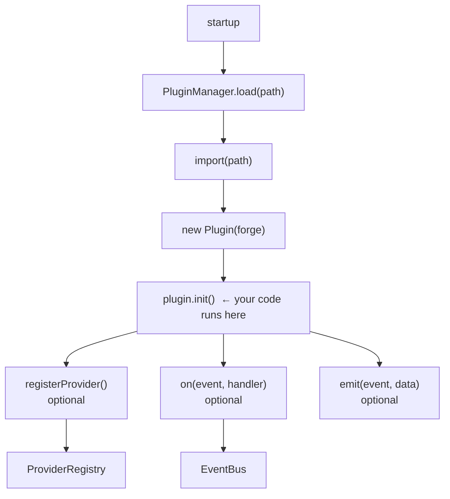

# Plugin System

AgentForge's plugin system lets you extend the platform without modifying core
code. Plugins can add custom providers, tools, and routing rules.

---

## How plugins work

Plugins are Node.js ES modules that export a class extending `BasePlugin`.
They are loaded at startup from paths or npm package names listed in
`agentforge.yml` (or via the CLI).



The `forge` object passed to the constructor gives the plugin access to all
AgentForge subsystems (provider registry, router, event bus, task queue, etc.).

---

## BasePlugin interface

```js
// src/plugins/plugin-manager.js
export class BasePlugin {
  constructor(forge) {
    this.forge = forge;   // Full AgentForge instance
    this.name = 'unnamed-plugin';
    this.version = '0.0.0';
  }

  /** Called once at load time. Register your additions here. */
  async register() {}

  /** Called when the plugin is unloaded or the server shuts down. */
  async unregister() {}
}
```

---

## Writing a custom provider plugin

```js
// my-plugin/index.js
import { BasePlugin } from 'agentforge/plugins';

class MyProvider {
  constructor(config) {
    this.id = 'my-provider';
    this.config = config;
  }

  async execute({ model, messages, max_tokens }) {
    // Call your custom API here
    const response = await fetch('https://my-api.example.com/v1/chat', {
      method: 'POST',
      headers: { Authorization: `Bearer ${this.config.api_key}` },
      body: JSON.stringify({ model, messages, max_tokens }),
    });
    const data = await response.json();
    return {
      content:    data.choices[0].message.content,
      tokens_in:  data.usage.prompt_tokens,
      tokens_out: data.usage.completion_tokens,
      finish_reason: data.choices[0].finish_reason,
    };
  }

  async healthCheck() {
    const r = await fetch('https://my-api.example.com/health');
    return r.ok;
  }
}

export default class MyProviderPlugin extends BasePlugin {
  constructor(forge) {
    super(forge);
    this.name = 'my-provider-plugin';
    this.version = '1.0.0';
  }

  async register() {
    const config = this.forge.config.providers?.['my-provider'] ?? {};
    const provider = new MyProvider(config);
    this.forge.providerRegistry.register('my-provider', provider);
    console.log('[my-provider-plugin] registered');
  }

  async unregister() {
    this.forge.providerRegistry.unregister('my-provider');
  }
}
```

---

## Writing a custom tool plugin

```js
// my-tools-plugin/index.js
import { BasePlugin } from 'agentforge/plugins';

export default class MyToolsPlugin extends BasePlugin {
  constructor(forge) {
    super(forge);
    this.name = 'my-tools-plugin';
  }

  async register() {
    // Register a tool that agents can call
    this.forge.toolRegistry?.register({
      name: 'fetch_url',
      description: 'Fetch the content of a URL and return the text',
      parameters: {
        type: 'object',
        properties: {
          url: { type: 'string', description: 'URL to fetch' },
        },
        required: ['url'],
      },
      async execute({ url }) {
        const res = await fetch(url);
        const text = await res.text();
        return { content: text.slice(0, 4000) };
      },
    });
  }
}
```

---

## Writing a custom routing rule plugin

```js
// my-routing-plugin/index.js
import { BasePlugin } from 'agentforge/plugins';

export default class MyRoutingPlugin extends BasePlugin {
  constructor(forge) {
    super(forge);
    this.name = 'my-routing-plugin';
  }

  async register() {
    // Prepend a custom rule that routes security tasks to a specific model
    this.forge.router?.prependRule({
      match: { type: 'security_audit' },
      force: 'claude-opus-4-6',
    });
  }
}
```

---

## Loading plugins

### From a local file

```yaml
# agentforge.yml
plugins:
  - path: ./plugins/my-provider-plugin/index.js
  - path: ./plugins/my-tools-plugin/index.js
```

### From an npm package

```bash
npm install agentforge-plugin-my-provider
```

```yaml
plugins:
  - package: agentforge-plugin-my-provider
```

### Via CLI

```bash
agentforge plugin load ./path/to/plugin.js
agentforge plugin unload my-provider-plugin
agentforge plugin list
```

---

## Plugin lifecycle

| Phase | What happens |
|---|---|
| `load` | Module is dynamically imported, class is instantiated with the forge object |
| `register` | `plugin.register()` is called — provider/tool/rule is added to the registry |
| `running` | Plugin is active; can subscribe to events via `forge.eventBus` |
| `unregister` | Called on graceful shutdown or explicit unload — clean up subscriptions, registrations |

---

## Accessing forge internals

The `forge` object passed to the plugin constructor exposes:

| Property | Type | Description |
|---|---|---|
| `forge.config` | Object | Parsed agentforge.yml |
| `forge.eventBus` | EventEmitter | Subscribe/emit events |
| `forge.taskQueue` | TaskQueue | Add, query, update tasks |
| `forge.quotaManager` | QuotaManager | Query quota state |
| `forge.costTracker` | CostTracker | Record or query costs |
| `forge.agentPool` | AgentPool | Query agent states |
| `forge.orchestrator` | Orchestrator | Start/stop the main loop |
| `forge.providerRegistry` | ProviderRegistry | Register/get providers |
| `forge.router` | Router | Add routing rules |
| `forge.db` | Database | Direct SQLite access (advanced) |

---

## Publishing a plugin to npm

Convention for npm packages: prefix the package name with `agentforge-plugin-`.

```json
{
  "name": "agentforge-plugin-my-provider",
  "version": "1.0.0",
  "type": "module",
  "main": "index.js",
  "keywords": ["agentforge", "agentforge-plugin"],
  "peerDependencies": {
    "agentforge": ">=0.1.0"
  }
}
```
